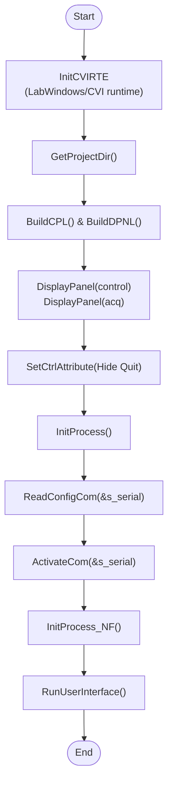

좋습니다 👍  
지금까지 분석한 `ControlPumpMFC.h`(헤더) + `ControlPumpMFC.c`(구현 파일)을 **한눈에 이해할 수 있도록** 핵심 구조와 흐름을 그림·표 형식으로 정리해 드릴게요.

---

## 1. 전체 동작 흐름도

text

`[프로그램 시작]        │       ▼ InitCVIRTE ──┐  (LabWindows/CVI 런타임 초기화)              │ GetProjectDir & UI 패널 로드 (control_handle, acq_handle)              │              ▼      InitProcess()              │     ┌────────┴────────┐     ▼                 ▼ ReadConfigCom      ActivateCom (직렬포트 열기)               │          Delay(1.5s)  장치 준비 대기              │              ▼   InitProcess_MFC()   (펌웨어 버전, 보드 개수 MODBUS로 조회)      │      ├─ 실패 → 종료      │      └─ 성공           ▼      InitConfig_MFC()      (UI 라인 인덱스, 보정값 파일 로드)           ▼      UI Timer 시작           ▼   [RunUserInterface 루프]           │ ┌─────────┴─────────┐ ▼                   ▼ 사용자 조작           주기적 상태조회 (버튼, 슬라이더)     (Timer 이벤트)  │                   │ SetDutyBoard         ReadRegister_MFC WriteSingleReg       DecodeData_MFC  │                   │ MODBUS Write         MODBUS Read  │                   │ 장치 응답 수신────────┘  │ DecodePacket, Error_MFC, UI 업데이트`

---

## 2. 주요 구성요소

## (1) 헤더 파일에서 정의되는 것 (`ControlPumpMFC.h`)

- **명령 코드 상수** : `CMD_RUN`, `CMD_CLEAN`, ...
    
- **MODBUS 레지스터 주소** : `MFC_CMD`, `MFC_RPW`, `MFC_SPA` ...
    
- **장치 상태 구조체 S_MFC**  
    (보드 수, duty 배열, 보정계수, offset 등)
    
- **전역 변수** : UI 패널 핸들, 직렬포트 버퍼, 플래그
    
- **함수 원형** : Init, Read, Write, Error 처리 등
    

---

## (2) C 파일의 주요 함수 (`ControlPumpMFC.c`)

|함수명|역할|
|---|---|
|**main**|CVI 초기화, UI 로드, `InitProcess` 실행 후 UI 루프 시작|
|**InitProcess**|통신 설정 로드 및 포트 오픈, MFC 장치 초기화 시도|
|**InitProcess_MFC**|MFC 펌웨어 버전/보드 수 확인|
|**InitConfig_MFC**|UI 인덱스 매핑, 보정값 로드, 초기 플래그 설정|
|**ReadConfigProVal_MFC**|`ConfigProVal.cfg` 읽어 보정계수/기본 값 로드|
|**ReadRegister_MFC**|MODBUS Read 패킷 구성·송신·수신|
|**WriteSingleReg_MFC**|MODBUS 단일 레지스터 쓰기|
|**SetDutyBoard_MFC**|6채널 Duty 계산해 MODBUS로 쓰기 (보정식 적용)|
|**ReadDutyBoard_MFC**|특정 보드 Duty 값 읽기|
|**Error_MFC**|에러 코드 → 문자열 변환 UI 표시|
|**DecodeData_MFC**|MODBUS 응답 해석하여 구조체에 저장|

---

## 3. 데이터 흐름 (요약)

1. **UI → 함수 호출**
    
    - 버튼/슬라이더 → `WriteSingleReg_MFC` or `SetDutyBoard_MFC`
        
2. **패킷 생성**
    
    - ID(0x01), 명령코드, 주소, 값 → `s_serial.send[]`
        
3. **직렬 송신**
    
    - `SendToCom()` 호출
        
4. **장치 응답 수신**
    
    - `ReadFromCom()` → 수신 버퍼
        
5. **데이터 해석**
    
    - `DecodeData_MFC()` → `s_mfc` 구조체 갱신
        
6. **UI 갱신**
    
    - 패널 컨트롤에 값 반영
        
7. **타이머 주기**
    
    - 상태 모니터링, 안전 제어
        

---

## 4. 핵심 포인트 한 줄 요약

> **이 프로그램은** LabWindows/CVI 기반 UI에서 발생한 제어 명령을 MODBUS 프로토콜 직렬통신으로 MFC/펌프/솔레노이드 밸브에 보내고, 주기적으로 장치 상태를 읽어 보정 값을 적용하여 UI에 표시하는 **실시간 펌프·밸브 제어 시스템**입니다.

---

